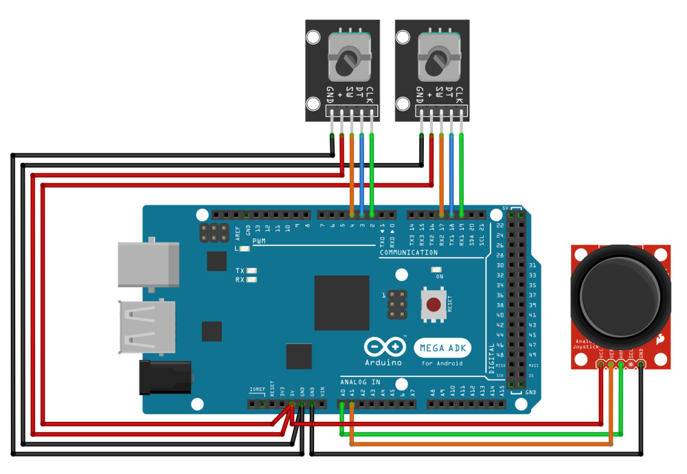
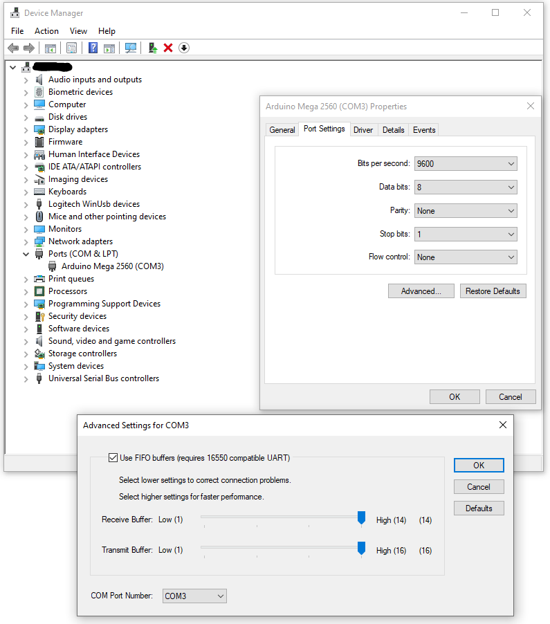

# MSFS Touch Panel Technical Detail

## Arduino

### Parts

* Arduino Mega 2560
* KY-040 rotary encoder (2) or a dual encoder
* KY-023 joystick module 
* Wires
* Optional: breadboard for testing and temporary connections

### Wiring Diagram (based on Arduino Mega 2560 board)

Currently, the thumb switch on joystick is not being used and it is not wired into Arduino board yet. (In reality, I ran out of wires when building the Arduino controls!)

Please download [Fritzing](https://fritzing.en.lo4d.com/download) and [Arduino design diagram](TouchPanel/Arduinoagent/Arduino/fritzing/) to see how the wires and control comes together.

### Sketches

Please download [Arduino Sketches](TouchPanel/Arduinoagent/Arduino/) for the above wiring design plus encoder and joystick control library and flash them to your Arduino device. I welcome technical input to how to code the Arduino sketches better and more efficient!

### Serial Port Configuration

The MSFS Touch Panel server is coded to use Arduino on COM Port 3 with 9600 baud rate. If after the Arduino is connected to your PC and the COM port is not on COM 3, you can change it by going to:

Device Manager => Ports (COM & LPT) => Your connected Arduino Board => Port Settings => Advanced => COM Port Number

	
	
	
	

 
