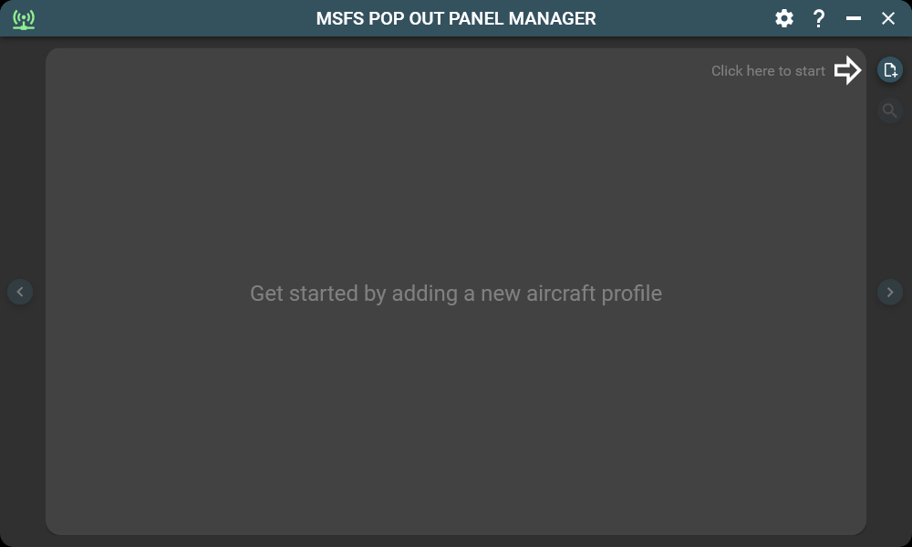
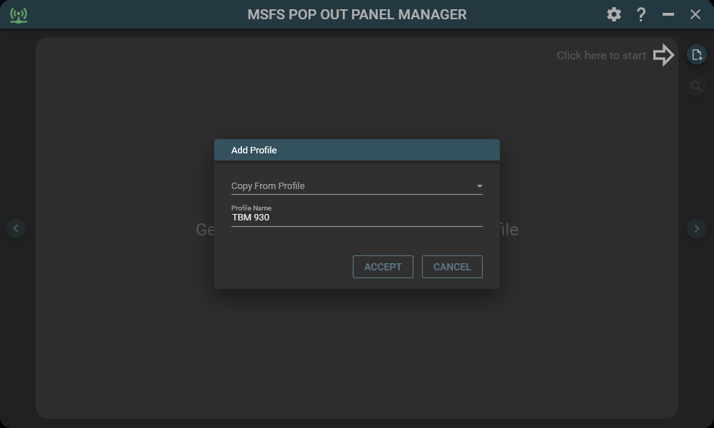
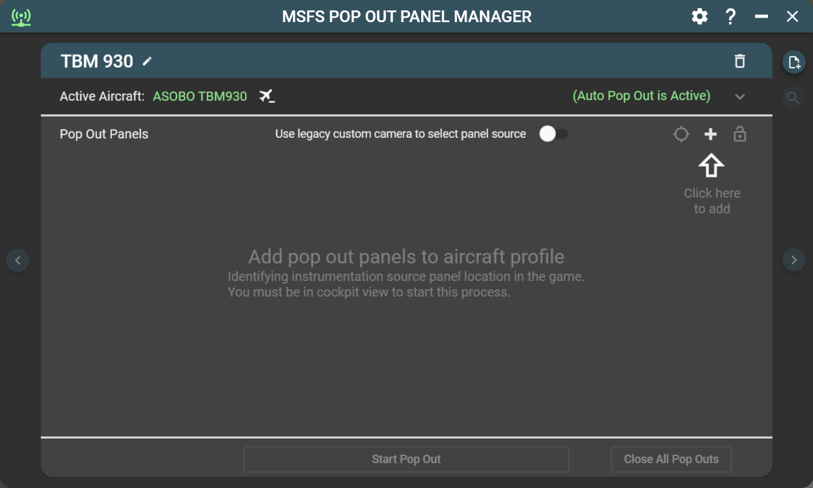
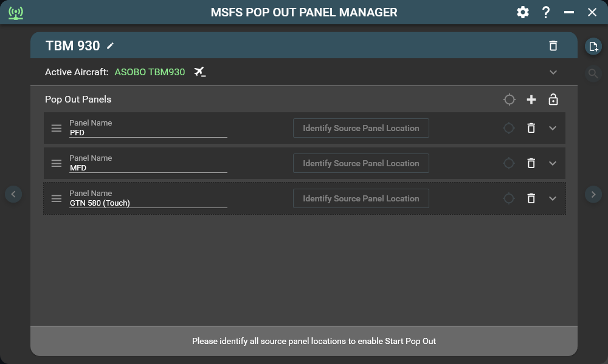

# GETTING STARTED

In this tutorial, you'll be adding 3 pop out panels for the aircraft TBM 930. Two of the panels is display only (PFD and MFD) and the third is a touch screen pop out (GTC 580).

To get started, launch MSFS Pop Out Panel Manager and then start MSFS. When you are at the main menu select TBM 930 as your aircraft and start a flight session. Back to Pop Out Panel Manager, you should see the following screen and you can click the Add Profile button to add your first aircraft profile. 

 

 

 

Type the name for the new aircraft profile "TBM 930" and click Accept.

 
 

 
 

 

Since your current in game aircraft is TBM 930, once the new profile is added, your selected active in-game aircraft will automatically bind this profile (in green color) and auto pop out is automatically activated. This binding will allow Pop Out Panel Manager to automatically switch to this profile when you switch to TBM 930 aicraft in the game. Only one profile can be bound to an in-game aircraft at a time and you can unbind aircraft at any time. Next click the Add Pop Out Panel button 3 times to add 3 panels to this profile.

  

 

 

Once the 3 panels are added, enter descriptive name for each of the 3 panels.

 

 

 

Next, click the "Identify" button one at a time. This is to identify the source instrumentation panel location. After each click of the button, left click on the game screen at the corresponding instrumentation panel in game. A circle will appear to match the pop out panel circle color. You can also change "fixed camera" view if you cannot see the panel you want on screen. If you need to adjust the color circle placement, just left click and drag the circle to new location.

  

 

 

Once you're satified with the color circles placement for all panels, click the Toggle Edit Source Panel Location button (the green target icon). This will end the source panel configuration and will save your game window size (if using Windowed mode) to be recalled later to be used when popping out panels. Since the 3rd panel (GTN 580 touch) is also a touch enabled panel using POPM touch emulation, you can click the hand icon for this panel at this time. The hand will turn green which indicate the panel now has touch emulation enabled. 

The Start Pop Out button should now be enabled. Click this button and start the pop out process. If Pop Out Panel Manager app window overlaps your selected instrumentation panels, don't worry, the app will relocate itself when simulating the in-game pop out keystrokes. You should also see a progress window indicating Pop Out Manager is in process of configuring and popping out panels.

 

 

 

Once the process has been completed successfully, you should see all 3 panels appear at the upper left corner of the game screen. All 3 pop out panel definitions will now have green border showing everything is working and the panels are popped out using the default size specified by the particular aircraft. You can then configure the panel by:

* Change the top, left, width, and height by entering a number 
* Use the up/down arrow next to each property and a pop out box will allow you to change the property by 1 or 10 pixels at a time.
* For the fastest way, click the Move and Resize Panel icon, this will allow you to use keyboard shortcuts to adjust the panel. Please see help section of the app for keyboard commands (click the question mark icon at the upper right corner of the app).

In this tutorial, if you haven't done so, since the 3rd panel is a touch enable panel (GTC 580). You can click the hand icon for this panel to activate touch support.

Once you've completed all panel configurations, please click the Lock icon to lock this profile from accidental changes.

 
 

 

 

If you encounter any error during pop out, the panel with error will have a red border. In this tutorial, the problem is the source panel blue circle for this particular pop out is not within the in-game instrumentation panel area. To fix this, click the Toggle Edit Source Panel button, and then use your mouse to drag and move the blue circle to a location within the GTC 580 panel. Finally, click the Toggle Edit Source Panel button again to save the changes. Now click Start Pop Out and the error should be resolved.

Tip: Sometimes, you may encounter issue in MSFS that certain panel does not pop out correctly because of timing or panel overlapping issues. You can try changing the order in how Pop Out Panel Manager launching the pop out by reording the pop out panel definition using mosue drag and drop. You can click and drag to arrange pop out panel definitions to new sequence.

 

 

 

 

An additional feature for Pop Out Panel Manager is you can add and manage built-in panels from the toolbar such as Checklist, ATC, Weather panel. One use case is you can place a panel such as ATC on a touch screen, configure the panel to be touch enabled, and operate this panel using touch. 

To do this, first check the Include in-game menu bar panels option for the profile. The built-in panels themselves have to be opened manually and popped out first. Currently, Pop Out Panel Manager do not have a way to control built-in panel. Luckily, MSFS will remember these built-in panels opened and popped out state. As long as you don't close them during your flight session, they will be reopened and popped out the next time when you start a flight.

In this tutorial, when you have ATC built-in panel opened and popped out, click Start Pop Out button. A new entry for ATC is then added to the profile. You can configure its size and location and touch capability like any other pop out panel.

 

