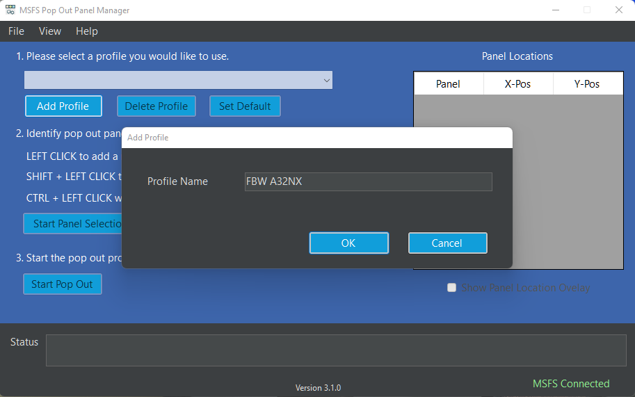
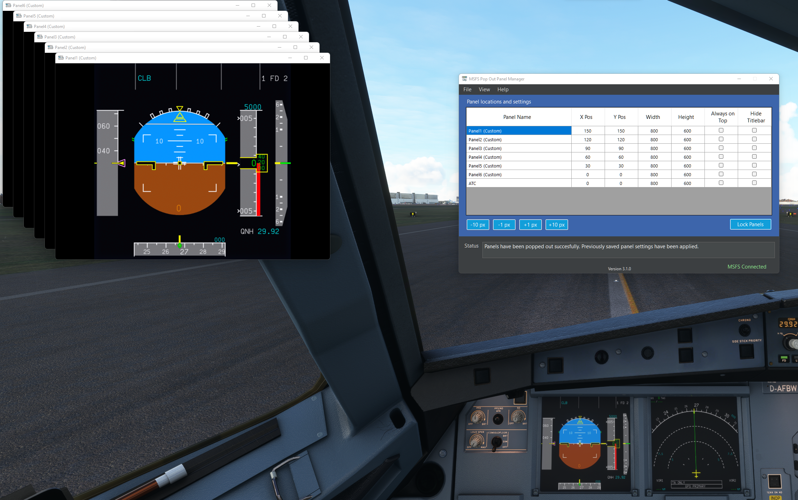
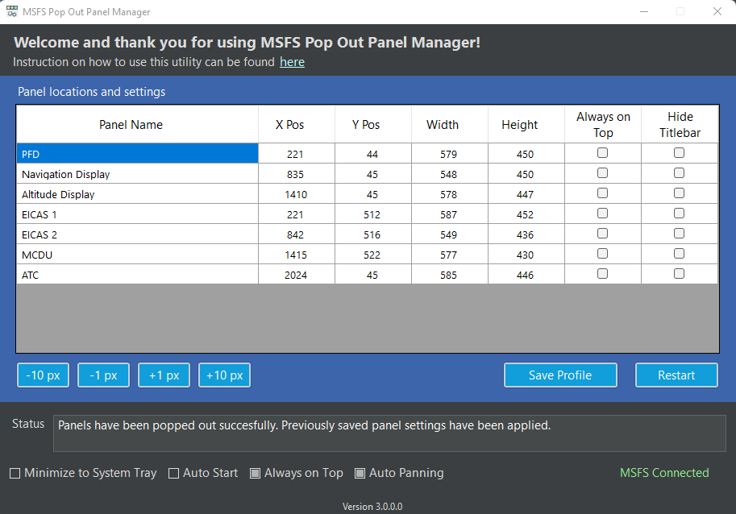

# MSFS Pop Out Panel Manager
MSFS Pop Out Panel Manager is an application for MSFS 2020 which helps pop out, save and re-position pop out panels to be used by applications such as Sim Innovations Air Manager or to place pop out panels onto another monitor automatically.

[FlightSimulator.com forum thread regarding this project](https://forums.flightsimulator.com/t/msfs-pop-out-panel-manager-automatically-pop-out-and-save-panel-position/460613)

### IMPORTANT! Version 3.0 file format is not compatible with previous version user profile data format since additional information has been added and updated to support new features. Please continue to use version 2.2 of the application if it works for you and you do not need the new features. If you're technical, please see User Profile Data Files below to do a manual data transfer.

## Version 3.0 NEW FEATURES!

* Provided 2X pop out and panel separation performance.
* Display resolution independent. Tested on 1080p/1440p/4k display.
* New Cold Start feature. Panels can be popped out and recalled later even when they're not turned on.
* New Auto Panning feature remembers the cockpit camera angle when you first define the pop out panels. You can now pan, zoom in, and zoom out to identify offscreen panels and the camera angle will be saved and reused. This feature requires the use of Ctrl-Alt-0 and Alt-0 keyboard binding to save custom camera view per plane configuration. If the keyboard binding is currently being used. The auto-panning feature will overwrite the saved camera view if enabled.
* New fine-grain control in positioning panels down to pixel level. 
* New user friendly features such as Always on Top, realtime readout as you position panels, a more intuitive user interface and status messages.
* Technical: Rewritten code base to improve code structure and performance.

## History: Pop Out Panel Positioning Annoyance
In MSFS, by holding **RIGHT ALT** + **LEFT CLICKING** some instrumentation panels, these panels will pop out as floating windows that can be moved to a different monitor. But this needs to be done every time you start a new flight, ALT-RIGHT clicking, split out child windows, move these windows to final location, rinse and repeat. For predefined toolbar menu windows such as ATC, Checklist, VFR Map, their positions can be saved easily and reposition at the start of each new flight using 3rd party windows positioning tool because these windows have a **TITLE** in the title bar when they are popped out. But any custom popouts such as PFD and MFD do not have window title. This makes remembering their last used position more difficult and it seems very annoying to resize and re-adjust their positions to be used by Air Manager or other overlay tool on each new flight.

## Concepts of the Application
What if you can do the setup once by defining on screen where the pop out panels will be, click a button, and the application will pop these panels out and separate them for you. Then you just need to move these panels to their final positions. Next time when you start a flight, with a single button click, your panels will automatically pop out for you and move to their preconfigured positions. Easy peasy!

Before v3.0 of the application, heavy image recognition was used to figure out how to pop out and separate the panels, figure out which panel is which by plane type and configure them accordingly. Although, the image recognition is reasonably accurate, there is lot to be desired. Especially on Cold Start, image recognition will not work at all because all panels are black to start with.

With v3.0, redesign from the ground up about how to pop out and separate the panels and navigate around many of Asobo's bug, many of the image recognition code is now removed and replaced by pixel calculation algorithm to figure out how to separate panels accurately when they're being popped out in all display resolutions. Also, there is no longer the need to identify what panel is what since everything is done by pop out sequence. 

## How to Use?
[Here](images/doc/userguide.mp4) is a video of what the app will do. TBD: will get update to show v3.0.

 1. Start the application **MSFSPopoutPanelManager.exe** and it will automatically connect when MSFS starts. You maybe prompt to download .NET framework 5.0. Please see the screenshot below to download and install x64 desktop version of the framework.

 2. First create a new plane profile (for example A32NX by FlybyWire)
 

 3. Once the game has started and you're at the beginning of flight, please click "Start Panel Selection" to define where the pop out panels will be using LEFT CLICK. Use CTRL-LEFT CLICK when done to complete the selection.
 

 4. Now, click "Start Pop Out". At this point, please be patient. The application will start popping out and separating panels one by one and you will see a lot of movement on the screen. If something goes wrong, just follow the instruction in the status message and try again.
 
 5. Once the process is done, you will see a list of panels line up in the upper left corner of the screen. All the panels are give a default name. You can name them anything you want if desire. Please go ahead and click "Save Profile". This will save the initial pop out configuration for this profile.
 

 6. Now, start the panel configruation by dragging the pop out panels into their final position. You can also type value directly into the data grid to move and resize a panel. The +/- pixel buttons by the lower left corner of the grid allow you to change panel position at the chosen increment/decrement by selecting the datagrid cell (X-Pos, Y-Pos, Width, Height). You can also select "Always on top" and "Hide titlebar" if desire. Once all the panels are at their final position, just click "Save Profile" again.
 

  7. To test if everything is working. Once the profile is saved, please click "Restart". This will close all the pop out (except the main menu bar ones) and you're back to the start of the application. Now click "Start Pop Out" and see the magic happens!

8. With auto panning feature enabled, you do not have to line up the circles that identified the panels in order for the panels to be popped out. But if you would like to do it manually without auto-panning, on next start of the flight, just  line up the panels before clicking "Start Pop Out".

## User Profile Data Files

The user plane profile data and application settings data are stored as JSON files under the following folder path.

* userdata/userprofiledata.json
* userdata/appsettingdata.json

Note for technical user. If you would like to transfer existing profile data into v3.0 file format, you can first create a new profile in v3.0 of the app with the same panels and save it. Then you can open previous version of the configuration in config/userdata.json. You can match the old JSON attribute of "PanelDestinationList" of (Top, Left, Width, Height) for each panel and tranfer it over to the new file JSON attribute of "PanelConfigs". Please edit at your own risk.

## Current Known Issue

* You may encounter a bug with MSFS where a pop out panel is not Right-Alt clickable or the same panel is able to be popped out twice. This causes the application to not function properly. A new MSFS bug introduced since SU7 which I haven't encountered before?
* Sometimes when using the auto-panning feature, the keyboard combination of Ctrl-Alt-0 and Alt-0 do not work to save and load panel panning coordiates. First try to restart the flightsim and it usually fixes the problem. Otherwise, the only way to fix this is to redo the profile if you want the auto-panning feature since the camera angle is only being saved during the initial creation of the profile. The is another MSFS bug.
* If running the game in windows mode on your non-primary monitor in a multi-monitor setup with differnt display resolution, panel identification and separation may not work correctly. 
* Current application package size is bigger than previous version of the application because it is not a single EXE file package. With added feature of  exception logging and stack trace to support user feedback and troubleshooting, a Single EXE package in .NET 5.0 as well as .NET 6.0 has a bug that stack trace information is not complete. Hopefully, Microsoft will be fixing this problem. 

 
## Common Problem Resolution

* Unable to pop out panels when creating a profile for the first time with error such as "Unabled to pop out panel #X". If the panel is not being obstructed, by changing the sequence of the pop out when defining the profile may help solve the issue. Currently there are some panels in certain plane configuration that does not follow predefined MSFS pop out rule.

* Unable to pop out panels on subsequent flight. Please follow status message instruction. Also, if using auto-panning, Ctrl-Alt-0 may not have been saved correctly during profile creation. You will be able to fix thie by manually line up the panel circles identifier and do a force save view by pressing Ctrl-Alt-0.

* Unable to pop out ALL panels. This may indicate a potential miscount of selected panels (circles) and the number of actual panels that got popped out. You may have duplicate panels in your selection or panels that cannot be popped out.

* If you encounter application crashes or unknown error, please help attach the file **error.log** in the application folder and open a ticket issue in the github repo for this project. This is going to help me troubleshoot the issue and provide hotfixes.
 

## Author
Stanley Kwok
[hawkeyesk@outlook.com](mailto:hawkeyesk@outlook.com) 

I welcome feedback to help improve the accuracy and usefulness of this application. You are welcome to take a copy of this code to further enhance it and use within your own project. But please abide by licensing terms and keep it open source:)

## Credits
[Tesseract](https://github.com/charlesw/tesseract/) by Charles Weld - .NET wrapper for Tesseract OCR package. For version 1.x of application.

[AForge.NET](http://www.aforgenet.com/framework/) Image recognition library. For version 2.x of the application.

[DarkUI](http://www.darkui.com/) by Robin Perria

[MouseKeyHook](https://github.com/gmamaladze/globalmousekeyhook) by George Mamaladze

[Fody](https://github.com/Fody/Fody) .NET assemblies weaver by Fody

