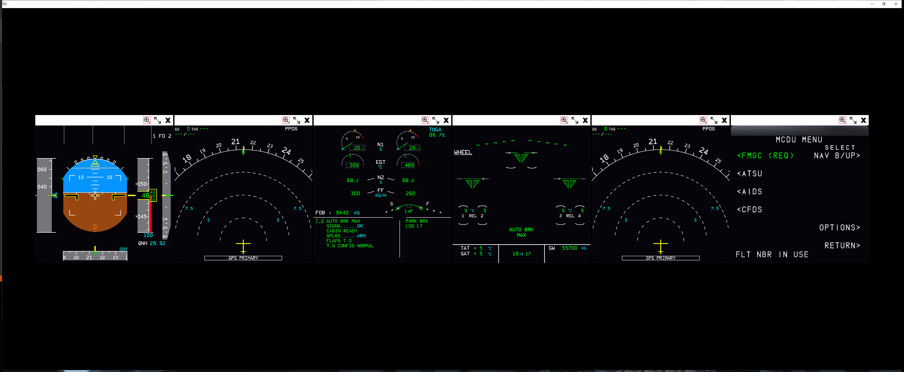
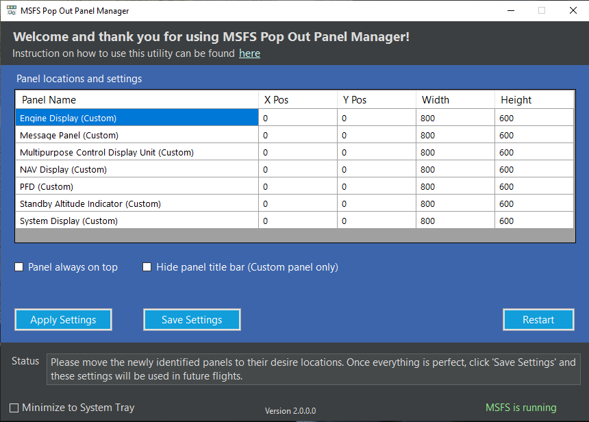
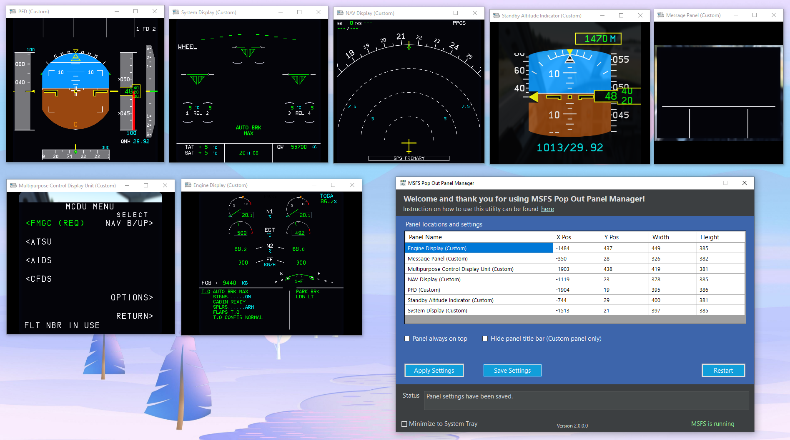

# MSFS Pop Out Panel Manager
MSFS Pop Out Panel Manager is an application for MSFS 2020 which helps pop out, save and re-position pop out panels such as PDF and MFD to be used by applications such as Sim Innovations Air Manager's overlay. This is a **PROOF OF CONCEPT** application (to also be used by experimental feature in my other github development project - MSFS Touch Panel). I welcome any feedback to help improve the accuracy and usefulness of this application. You are welcome to take a copy of this code to further enhance it and use within anything you created. But please abide by licensing and make it open source:)

## Pop Out Panel Positioning Annoyance
In MSFS, by holding **RIGHT ALT** + **LEFT CLICKING** some instrumentation panels, these panels will pop out as floating windows that can be moved to a different monitor. But this needs to be done every time you start a new flight, ALT-RIGHT clicking, split out child windows, move these windows to final location, rinse and repeat. For predefined toolbar menu windows such as ATC, Checklist, VFR Map, their positions can be saved easily and reposition at the start of each new flight using 3rd party windows positioning tool because these windows have a **TITLE** in the title bar when they are popped out. But panels such as PFD and MFD on G1000 or the multi control panel on G3000 or panels on A320/CJ4 do not have window title. This makes remembering their last used position more difficult and it seems very annoying to resize and readjust their positions to be used by Air Manager or other overlay tool on each new flight.

## Concepts of the Application
What if you can do the setup once by defining on screen where the pop out windows will be, click a button, and the application will figure out everything for you. Then you just need to drag these pop out windows to their final desire location (again doing it once) on screen and it will save their final positions. Next time when you start a flight, you just re-position your initial game screen pop out coordinates and click a button and Viola, everything will be done for you. No ALT-Right clicking, no splitting windows manually (imaging you just pop out 7 windows for A32NX), no re-positioning windows to their final destination on screen. The pop outs will even have a title for you to use if you prefer using PowerToys fancy zone to position the windows yourself.

Version 1.0 of this application uses OCR (text recognition) technology to try to determine what pop out window is what. It works for some windows but not others. As one of the user in Flightsimulator.com forum asked, can the application pop out windows from A32NX where some of the windows have no text. Also, this version does not do auto pop out. So I scraped that idea of improving OCR and think about using something else instead.

Version 2.0 uses image recognition and it seems to do a pretty decent job in popping out panels and figure out what window is what. I setup very simple image recognition data (aka. mostly non-scale image match for now) for most planes in MSFS and tested it mainly on 3440x1440 and 1920x1080 resolution. Regular 1440p should work as expected. 4K resolution may or may not work since I don't have a 4K screen to test but I scaled up some of the image recognition data for 4K so it may work! The image recognition uses a confident score to determine what the pop out window most likely to be.

The v2.0 application concept is as follow:

1. First allow user to define where all the 'ALT-Right Click' panels on the screen will be for a given plane profile and save these information.
2. Using image recognition, the application figures out how to pop out these panels and also do the clicking for you.
3. Once the pop out panels are split out, the application will start image recognition to determine the type and content for each panel. It also add title bar to these pop out window. Built-in toolbar panel such as ATC, VFR Map will work too.
4. After pop out panels are analyzed, the user will move these panels to their desire locations. An UI will also allow the user to resize and position these windows to pixel perfect location.
5. User will then save these data and start flying.
6. On subsequent flight, user will just need to reposition the definition of the 'ALT-Right Click' panels and the application will do the rest.
 
## How to Use?
[Here](images/doc/userguide.mp4) is a video of what the app will do.

 1. Start the application **MSFSPopoutPanelManager.exe** and it will automatically connect when MSFS starts.
 2. Once the game starts and you're at the beginning of flight, first select a plane profile (for example A32NX by FlybyWire)
 3. You then click "START PANEL SELECTION" to define where the pop out panels will be using LEFT CLICK and CTRL-LEFT CLICK when done to save these information.
 

 4. Make sure all panels are ON and active. The application's image recognition engine will not be able to analyze and distinguish blank panel screens.
 5. Now, click "ANALYZE". **!!!IMPORTANT, please make sure there are no other window obstructing pop out coordinates (where the numbers with circle are). Also, please DO NOT move your mouse during this time since the application is simulating mouse movements.** At last, please be patient (even using multi-thread, the execution of mouse movement will still take some time). The application will start popping out windows one by one and you will see a lot of windows movement on the screen. If something goes wrong, just close all the pop outs and try do "ANALYZE" again.
 

 6. Once analysis is completed, you will see a list of panels that have successfully processed by the application. 
 

 7. Please go ahead and drag the pop out panels into their final positions. You can also directly type in coordinates for these panels to move and resize them and then click "APPLY SETTINGS". Please click "SAVE SETTINGS" to update the grid data if you use the mouse to drag the panels. Here is an example when panels are dragged to a secondary monitor and click "SAVE SETTINGS".
 

 
 7. You can also select "Panels always on top" and/or "Hide panel title bar" if desire. !! IMPORTANT, panels without title bar cannot be moved. Please just unchecked "Hide panel title bar" then "Apply Settings" to get the panel's title bar back to move them.
 
 8. Once all the panels are at their final positions, click "SAVE SETTINGS" again and you're done. You can now close or minimize the application. 
 
 9. On subsequent flight, just reposition the pop out position for the selected plane profile and click "ANALYZE" and see the magic happens. Screenshots below used FBW A32NX as example since some of the pop outs were hidden when the flight starts.

Move your screen down a little bit by holding Right-Click in flight simulator until everything lines up. You can then click "ANALYZE".

10. Since the initial pop out positions may be different from plane to plane even when they are using the same instrumentation system, you can easily add new profiles in a configuration file and points it to the same analysisTemplateName. You can edit the configuration file [planeprofile.json](Config/planeprofile.json) in the **config** folder of the application to add additional profile. Look for profileId 1 and 2 in the file as example where both Cessna 172 and DA62 both uses Working Title G1000 NXi. 

## Image Recognition Concept and Application Configurability

To-Do

 
## Common Problem Resolution

 - Unable to pop out windows correctly - the predefined pop out panel coordinate may not line up correctly or movement of mouse is interfering with pop out execution. Please try to reposition the screen into pop out coordinates. Or you can close and restart the application, close all the opened pop outs, and try the analysis again.
 - Pop out windows are not recognized correctly - it is the current limitation of current implementation of image recognition algorithm. More sophisticated image recognition such as [SIFT](https://en.wikipedia.org/wiki/Scale-invariant_feature_transform) will be needed. This is to-do item on my list for future version of app. Also, the panel screen maybe blank which causes the image recognition engine to fail.
 -  Night time or different world location causes image recognition to fail - application has builtin redundancy image recognition data for this purpose (such as MFD recognition for G1000 where 75% of the screen is a map). But I may not have anticipate all the use cases yet. Please provide feedback and it will help me to improve the image recognition engine.
 - Running on non-native monitor resolution does not work - for example running 1080p window resolution on 1440p monitor will not work because of image scaling and calculation issue. But in-game resolution scaling will not get affected. This issue can only be fixed when using scale invariant algorithm or more advanced algorithm.

## Author
Stanley Kwok
[hawkeyesk@outlook.com](mailto:hawkeyesk@outlook.com) 

## Credits
[Tesseract](https://github.com/charlesw/tesseract/) by Charles Weld - .NET wrapper for Tesseract OCR package. For version 1.x of application.

[AForge.NET](http://www.aforgenet.com/framework/) Image recognition library.

[DarkUI](http://www.darkui.com/) by Robin Perria