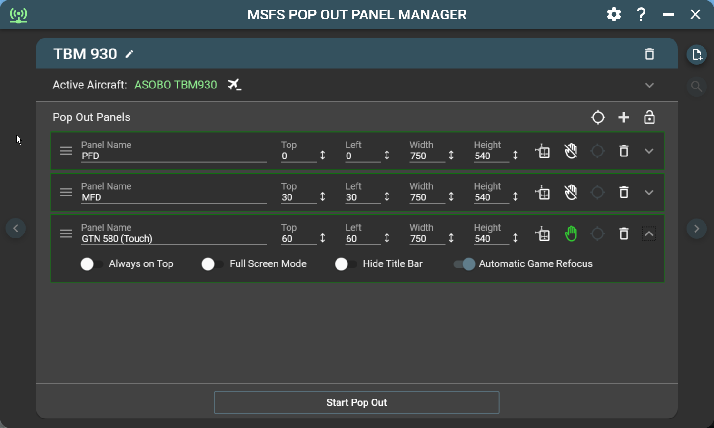

# MSFS Pop Out Panel Manager

MSFS Pop Out Panel Manager is an application for MSFS 2020 which helps pop out, save and position pop out panels to be used by utilities such as Sim Innovations Air Manager or to place pop out panels onto your screen or another monitor at predetermined locations automatically. It also adds touch capability to pop out panels that are operated on touch screen which is currently not supported by the game.

Please follow [FlightSimulator.com](https://forums.flightsimulator.com/t/msfs-pop-out-panel-manager-automatically-pop-out-and-save-panel-position/460613) forum thread regarding this project or comments at [Flightsim.to](https://flightsim.to/file/35759/msfs-pop-out-panel-manager). 

 

 

## Getting Started

[Please see Getting Started guide to setup your first profile](./GETTING_STARTED.md) - Updated for version 4.1.

Video showing how to create a new aircraft profile and panel source selection:  
https://vimeo.com/917361559

Video showing how to update existing aircraft profile (Pre-Version 4.1) to use the new panel selection method:  
https://vimeo.com/917364912 

Video showing how to use the new floating panel feature:  
https://vimeo.com/918153200

 

## How to Install 

1. After downloading the latest zip package from github repository or from Flightsim.to website, extract the zip package to a folder of your choice on your computer.

2. If you're using Auto Pop Out Panel feature, a plugin is required to be installed in MSFS community folder. Please copy the folder "zzz-ready-to-fly-button-skipper" into your MSFS community folder. This plugin is used to automatically skip the "Ready to Fly" button press when flight starts so Auto Pop Out Panel can start its process.

3. Start the application **MSFSPopoutPanelManager.exe** and it will automatically connect when MSFS/SimConnect starts. 

4. If Pop Out Panel Manager is not connecting to the game (green connection icon in the upper left corner of the app), you may be missing VC++ redistributable that is required for SimConnect to work. Please download and install the following [VC++ redistributable](https://aka.ms/vs/17/release/vc_redist.x64.exe) on your PC to resolve this issue. 

 

## How to Update

1. To update the application, you can download the latest zip package and directly extract the package into your Pop Out Manager installation folder and overwrite all files within. Your application setting and profile data will be safe.

2. You can also use the built-in auto update feature and let the application handles the update. If the update is optional, you can skip the update if you so choose. When you start the application and if an update is available, a dialog will appear and it will show the latest version's release notes and an option to update the application.

3. If you're not being prompt for update when new update is available, please try the following fix:

  - Restart you computer and most of the time this will do the trick.
  - Clear your default web browser cache on your computer since auto update will try to download latest version of update configuration file from github repository and the file may have been cached on your machine.
  - Clear Internet Browser History.  First search for "Internet Options" in Windows control panel. In "General" tab, select "Delete" in Browsing History section.

 

## Application Features
* Display resolution independent. Supports 1080p/1440p/4k display and ultrawide displays.

* Support multiple user defined aircraft profiles to save panel locations to be recalled later.

* Intuitive user interface to defined location of source panels to be popped out and configure the size and location of pop out panels.

* Enable touch support for pop outs on touch capable display. Please see [Touch Enable Pop Out Feature](#touch-enable-pop-out-feature) for more information.

* Auto game refocus to enable operation of pop out panels either by click or touch without losing flight control.

* Auto Pop Out feature. The application will detect active aircraft and will activate the corresponding profile on start of new flight session.

* Cold Start Feature. Instrumentation panels can be popped out even when they're not powered on (for G1000 Only) to overcome an outstanding MSFS bug.

* (Version 4.1+ backward compatibility support) Auto Panning feature remembers the cockpit camera angle when you first define the pop out panels. You can now pan, zoom in, and zoom out to identify offscreen panels and the camera angle will be saved and reused. This feature requires the use of Ctrl-Alt-0 keyboard binding to save custom camera view per plane configuration. (Can be configured to use 0 through 9). If the keyboard binding is currently being used. The auto-panning feature will overwrite the saved camera view if enabled.

* Fine-grain control of positioning of panels down to pixel level. 

* Panels can be configured to appear always on top, with title bar hidden, or stretch to full screen mode.

* Auto disable Track IR when pop out starts.

* User-friendly features such as application always on top, auto start, minimized to tray with keyboard shortcuts.

* Auto save feature. All profile and panel changes are saved automatically.

* Auto update feature. Application can auto-update itself when new version becomes available.

 

## Touch Enable Pop Out Feature

To enable touch support, just activate the hand icon for the panel that you want this support.

This feature will make pop out panel touch capable on touch screen monitor or tablet (through remote display tool such as [Spacedesk](https://www.spacedesk.net/). As of this writing, MSFS does not support touch natively on touch enabled display and Pop Out Panel Manager tries to fill this gap by providing touch capabilities to aircraft panels such as:

- King Air 350 G3000
- PMS GTN750
- PMS GTN530
- TBM 930 GTC580
- Flybywire A32NX EFB
- Aircrafts that have instrumentation panel that is clickable
- Or can be used for built-in panels such as Checklist, ATC, etc

The touch enabled pop out feature solved two limitations in MSFS.

- Limitation #1 - For pop out panel, touch events do not get pass through to panels such as King Air PFD or GTN750 and they can only be operated with a mouse. There is a work around if you’re using Spacedesk with tablet by disabling USB HID within Spacedesk drivers in Windows device manager. But if you’re using touch monitors directly connected to your gaming PC, then Spacedesk workaround is not an option.

- Limitation #2 - When you click or hover your mouse over any pop out panels on your main monitor or on another monitor, the game main window will lose focus and you can’t operate flight control without clicking the game window again. Pop Out Panel Manager provides a configurable game auto refocus when you click on or touch any pop out panels.

 

## User Profile Data Files

The user plane profile data and application settings data are stored as JSON files under your "Documents" folder. (%userprofile%\Documents\MSFS Pop Out Manager)

* userprofiledata.json

  Stored your various plane profiles.

* appsettingdata.json

  Stored your application preference settings.
  
* autoupdate.json

  Stored the application auto update information. This file can be deleted if you want to reset your update status.
  
You can backup this folder and restore this folder if you want to uninstall and reinstall MSFS Pop Out Manager.

 

## Current Known Issue

* Automatic power on for Auto Pop Out Panels feature will not work if you're using any flight control hardware (such as Honeycomb Alpha or Bravo) that permanently binds the master battery switch or master avionics switch. If the hardware control switch is in the off position, pop out manager won't be able to temporary turn on the instrumentation panels to pop them out. This seems to be a bug on Asobo side and only affects the G1000 instrumentation at the moment.

* Please see [Version](VERSION.md) file for latest known application issues and fixes.

 
 
## Common Problem Resolution

* Unable to pop out panel and the panel is highlighted in red. This may indicate an issue where your placement for the panel source circle is incorrect or some application window may be blocking Pop Out Panel Manager from clicking in the game to simulate pop out keystroke. Please try to adjust the panel source circle or reposition any window that can interfere with the app's operation. Or you can change the order or panels being popped, sometime this can resolve pop out issue. 

* If you encounter application crashes or unknown error, please help my continuing development effort by attaching the file **error.log** in the application Logs folder and open an issue ticket in github repo for this project. This is going to help me troubleshoot the issue and provide hotfixes.

* If you encounter an issue with panels that are not restored back to your saved profile locations, please check if you have other apps such as Sizer or Windows PowerToys that may have conflict with Pop Out Manager.

 

## Author
Stanley Kwok
[hawkeyesk@outlook.com](mailto:hawkeyesk@outlook.com) 

I welcome feedback to help improve the usefulness of this application. You are welcome to take a copy of this code to further enhance it and use within your own project. But please abide by licensing terms and keep it open source:)

## Donation

Thank you for your super kind support of this app!

 

## Credits
[Material Design in XAML Toolkit](http://materialdesigninxaml.net/) by Material Design team

[Hardcodet NotifyIcon](https://github.com/hardcodet/wpf-notifyicon) by Philipp Sumi, Robin Krom, Jan Karger

[Fody](https://github.com/Fody/Fody) .NET assemblies weaver by Fody

[WindowsHook](https://github.com/topstarai/WindowsHook) by Mark Kang

[WPF CalcBinding](https://github.com/Alex141/CalcBinding) by Alexander Zinchenko

[AutoUpdater.NET](https://github.com/ravibpatel/AutoUpdater.NET) by Ravi Patel