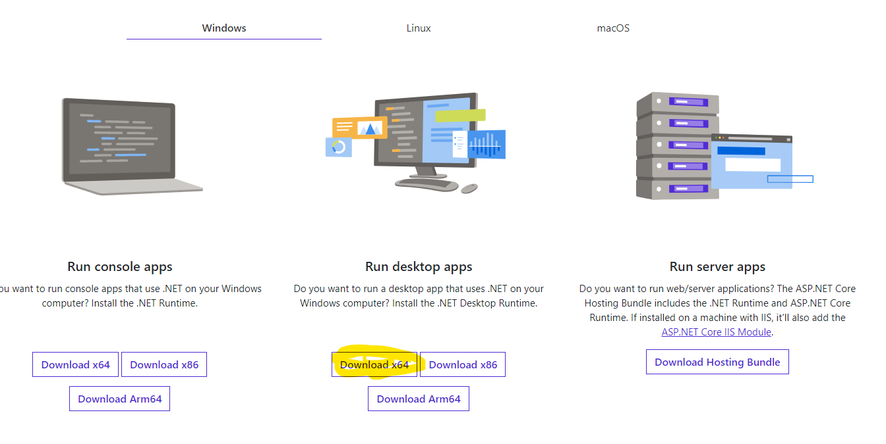
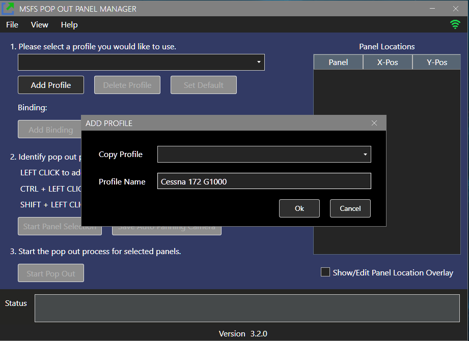
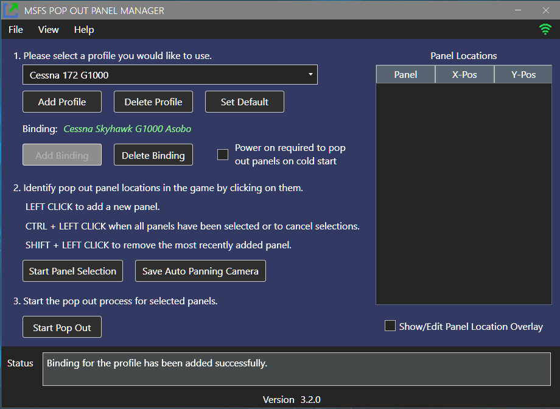
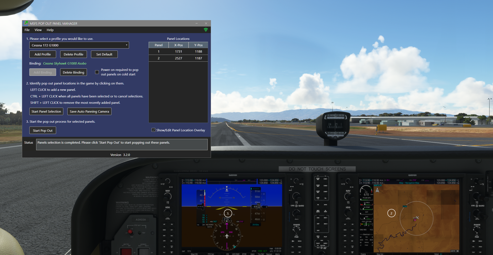

# MSFS Pop Out Panel Manager
MSFS Pop Out Panel Manager is an application for MSFS 2020 which helps pop out, save and re-position pop out panels to be used by applications such as Sim Innovations Air Manager or to place pop out panels onto another monitor automatically.

[FlightSimulator.com forum thread regarding this project](https://forums.flightsimulator.com/t/msfs-pop-out-panel-manager-automatically-pop-out-and-save-panel-position/460613)

## Version 3.2 NEW FEATURES!
* Added per monitor DPI-awareness support. The application should run and display correctly when using combination of mixed monitor (with high-DPI and low-DPI) resolutions and scaling.
* Added system tray icon access. Application can start minimize or minimize to system tray. System tray icon features a context menu to allow quick access to application functions.
* Added user requested feature to provide keyboard shortcut (Ctrl-Alt-P) to start panel pop out with either an active profile or a default profile selected.
* New copy profile feature. You can reuse your defined panel settings for another plane or plane/livery combination. This is a feature to solve the problem when the final panel placements are the same but the in-game panel locations are different. This also allows using a defined profile for different liveries for the same plane for Auto Pop Out. (See Auto Pop Out Panel experiment feature).
* Added quick panel location selection adjustment feature. You can now adjust panel locations without redoing the entire profile. Just click "Show/Edit Panel Location Overlay" checkbox, you can now drag and move the panel selection number circle. When you're done with the placement, the new location will automatically save for the profile.
* Added Save Auto Panning Camera Angle function if you need to adjust the in-game camera angle during panel selection.
* New logo icon for the app.
* New dark theme for the entire UI.
* Technical Note - Application is ported and rewritten with .NET WPF framework instead of WinForms and SimConnect is added to the app for Auto Pop Out feature and for future functionality expansions.

** Beta feature - Auto Pop Out Panels**

When a profile is defined, final panel placements are set, and bound to a plane type + livery combination. The application will automatically pop out all panels if a matched profile is detected when a flight starts.

[Online Video - feature in action](https://vimeo.com/674073559) - In the video, after clicking flight restart, the app did all the clicking by itself.

**How it works and how to use:**

The app will try to find a matching profile with the title of the plane (per livery). It will then automatically detect when a flight is starting and then click the "Ready to Fly" button. It will then power on instrumentation for cold start (if necessary), and pop out all panels. This feature allows panels to be popped out without the need of user interaction. If profiles are set and bound, you can auto-start the app minimized in system and as you start your flight, panels will automatically pop out for you.

* First make sure in File->Preferences, "Auto Pop Out Panels" option is turned on.

* For existing profile to use Auto Pop Out feature, just click "Add Binding" and bind the profile to the active plane in the game.

* Since Auto Pop Out need to match plane title to work, a profile must be bound to a plane to use the Auto Pop Out feature. You can continue to manually click start the pop out for unbound profile. Or better yet, use the new keyboard shortcut (Ctrl-Alt-P) to manually start the pop out process.

* During my testing, instrumentations only need to be powered on for Auto Pop Out to work for G1000/G1000 NXi plane during cold start. (There seems to be a bug in the game that you can't do Alt-Right click to pop out cold start panel for this particular plane variant). For other plane instrumentations I've tested (G3000, CJ4, Aerosoft CRJ 550/700, FBW A32NX), panels can be popped out without powering on. So please make sure the checkbox "Power on required to pop out panels on cold start" is checked for G1000 related profiles.

* If you want to fly the same plane with different livery, the plane title will be different for each livery. You can see the current in-game active plane + livery title by hovering your mouse over the connection icon in the upper right corner of the app. In order to use Auto Pop Out feature in this scenario, first defined the initial profile for a plane + livery combination. After you're satisfy the profile is working, switch the plane livery and create a new profile by copying the initial profile and bound it to the plane again (with the new livery selected). You should notice the binding name will be different even though all the panel settings are the same. Repeat this for as many liveries for the plane as needed.

* If after binding the livery and Auto Pop Out did not work (which means the app cannot find a match), please hover your mouse over the connecting icon in the app to see the current plane title reported by the game is the same as what you've bound to the profile. Sometimes, SimConnect does not update the plane title until the flight actually starts. So if you've done the binding before the flight start, sometime it will not work. Just just "Replace binding" again and confirm the plane title. 

* **TIPS:** One of the trick to force SimConnect to update the plane title after selecting a new livery is when you've selected a plane and livery in the World Map, click the "Go Back" button at the lower left of your screen. 

* **TIPS:** For technical user, there are parts in this feature that uses a timer when waiting to execute certain steps in the Auto Pop Out process. An example is how long to wait for the "Ready to Fly" button to appear because auto-clicking it. Depending on the speed of your machine, you can adjust the wait timer to speed up or slow down the auto pop out process. Please see the section "User Profile Data Files" in the documentation for instruction to edit appSettings.json file.

## Application Features

* Display resolution independent. Supports 1080p/1440p/4k display.
* Support multiple user defined profiles to save panel locations to be recalled later.
* Intuitive user interface to defined location of panels to be popped out.
* Cold Start feature. Panels can be popped out and recalled later even when they're not powered on.
* Auto Panning feature remembers the cockpit camera angle when you first define the pop out panels. You can now pan, zoom in, and zoom out to identify offscreen panels and the camera angle will be saved and reused. This feature requires the use of Ctrl-Alt-0 and Alt-0 keyboard binding to save custom camera view per plane configuration. If the keyboard binding is currently being used. The auto-panning feature will overwrite the saved camera view if enabled.
* Fine-grain control in positioning panels down to pixel level. 
* User-friendly features such as application Always on Top and Auto Start as MSFS starts.
* Auto save feature. All profile and panel changes get save automatically.

## History: Pop Out Panel Positioning Annoyance
In MSFS, by holding **RIGHT ALT** + **LEFT CLICKING** some instrumentation panels, these panels will pop out as floating windows that can be moved to a different monitor. But this needs to be done every time you start a new flight, ALT-RIGHT clicking, split out child windows, move these windows to final location, rinse and repeat. For predefined toolbar menu windows such as ATC, Checklist, VFR Map, their positions can be saved easily and reposition at the start of each new flight using 3rd party windows positioning tool because these windows have a **TITLE** in the title bar when they are popped out. But any custom pop outs such as PFD and MFD do not have window title. This makes remembering their last used position more difficult and it seems very annoying to resize and re-adjust their positions to be used by Air Manager or other overlay tool on each new flight.

## Concepts of the Application
What if you can do the setup once by defining on screen where the pop out panels will be, click a button, and the application will pop these panels out and separate them for you. Then you just need to move these panels to their final positions. Next time when you start a flight, with a single button click, your panels will automatically pop out for you and move to their preconfigured positions. Easy peasy lemon squeezy!

Before v3.0 of the application, heavy image recognition was used to figure out how to pop out and separate the panels, figure out which panel is which by plane type and configure them accordingly. Although, the image recognition is reasonably accurate, there is lot to be desired. Especially on Cold Start, image recognition will not work at all because all panels are black to start with.

With v3.0, redesign from the ground up about how to pop out and separate the panels and navigate around many of Asobo's bug, many of the image recognition code is now removed and replaced by pixel calculation algorithm to figure out how to separate panels accurately when they're being popped out in all display resolutions. Also, there is no longer the need to identify what panel is what since everything is done by pop out sequence. 

## How to Use?
[Here](images/doc/userguide.mp4) or [Online](https://vimeo.com/668430955) is a video of how the app works. 

 1. Start the application **MSFSPopoutPanelManager.exe** and it will automatically connect when MSFS/SimConnect starts. You maybe prompt to download .NET framework 5.0. Please see the screenshot below to download and install x64 desktop version of the framework.

 2. First start the game and start a flight. Then, in the app, create a new profile (for example: Cessna 172 G1000)
 

 3. If you want to associate the profile to the current plane to use the Auto Pop Out feature, click "Add Binding".

 

 
 3. Now you're ready to select the panels you want to pop out. Please click "Start Panel Selection" to define where the pop out panels will be using LEFT CLICK. Use CTRL-LEFT CLICK when done to complete the selection. You can also move the number circles at this point to do final adjustment.
 

 4. Now, click "Start Pop Out". At this point, please be patient. The application will start popping out and separating panels one by one and you will see a lot of movements on screen. If something goes wrong, just follow the instruction in the status message and try again.
 
 5. Once the process is done, you will see a list of panels line up in the upper left corner of the screen. All the panels are given a default name. You can name them anything you want if desire.
 

 6. Now, start the panel configuration by dragging the pop out panels into their final position (to your main monitor or other monitors). You can also type value directly into the data grid to move and resize a panel. The +/- pixel buttons by the lower left corner of the grid allow you to change panel position at the chosen increment/decrement by selecting the datagrid cell (X-Pos, Y-Pos, Width, Height). You can also select "Always on Top" and "Hide Titlebar" if desire. Once all the panels are at their final position, just click "Lock Panel" to prevent further panel changes.
 

7. To test if everything is working. Once the profile is saved, please click "Restart" in the File menu. This will close all pop outs, except the built-in ones from the game main menu bar, and you're back to the start of the application. Now click "Start Pop Out" and see the magic happens!

8. With auto panning feature enabled, you do not have to line up the circles that identified the panels in order for the panels to be popped out. But if you would like to do it manually without auto-panning, on next start of the flight, just  line up the panels before clicking "Start Pop Out" if needed.

## User Profile Data Files

The user plane profile data and application settings data are stored as JSON files under the following folder path.

* userdata/userprofiledata.json
* userdata/appsettingdata.json

**Note for technical user**. If you would like to shorten or extend the wait time for each step during Auto Pop Out, Panel, you can edit the following JSON element in appsettingdata.json file. The wait time is in seconds. If you don't see this JSON element, just update any File->Preferences setting and it will trigger this JSON element to be saved into the file.

"AutoPopOutPanelsWaitDelay": {
    "ReadyToFlyButton": 3,
    "InitialCockpitView": 3,
    "InstrumentationPowerOn": 2
}

## Current Known Issue

* Automatic power on for Auto Pop Out Panel feature will not work if you're using any flight control hardware (such as Honeycomb Alpha or Bravo) that permanently binds the master battery switch or master avionics switch. If the hardware control switch  is in the off position, pop out manager won't be able to temporary turn on the instrumentation panels to pop them out. This seems to be a bug on Asobo side and only affects the G1000 instrumentation at the moment.

* Sometimes when using the auto-panning feature, the keyboard combination of Ctrl-Alt-0 and Alt-0 do not work to save and load panel panning coordinates. First try to restart the flightsim and it usually fixes the problem. Otherwise, the only way to fix this is to redo the profile if you want the auto-panning feature since the camera angle is only being saved during the initial creation of the profile. The is another MSFS bug.

* Current application package size is bigger than previous version of the application because it is not a single EXE file package. With added feature of exception logging and stack trace to support user feedback and troubleshooting, a Single EXE package in .NET 5.0 as well as .NET 6.0 has a bug that stack trace information is not complete. Hopefully, Microsoft will be fixing this problem. 

 
## Common Problem Resolution

* Unable to pop out panels when creating a profile for the first time with error such as "Unable to pop out panel #X". If the panel is not being obstructed by another window, by changing the sequence of the pop out when defining the profile may help solve the issue. Currently there are some panels in certain plane configuration that does not follow predefined MSFS pop out rule.

* Unable to pop out panels on subsequent flight. Please follow status message instruction. Also, if using auto-panning, Ctrl-Alt-0 may not have been saved correctly during profile creation. You can trigger a force camera angle save by clicking the "Save Auto Panning Camera" button for the profile. 

* Unable to pop out ALL panels. This may indicate a potential miscount of selected panels (circles) and the number of actual panels that got popped out. You may have duplicate panels in your selection or panels that cannot be popped out.

* If you encounter application crashes or unknown error, please help my continuing development effort by attaching the file **error.log** in the application folder and open an issue ticket in github repo for this project. This is going to help me troubleshoot the issue and provide hotfixes.

* If you encounter an issue with panels that are not restored back to your saved profile locations, please check if you have other apps such as Sizer or Windows PowerToys that may have conflict with Pop Out Manager.
 

## Author
Stanley Kwok
[hawkeyesk@outlook.com](mailto:hawkeyesk@outlook.com) 

I welcome feedback to help improve the usefulness of this application. You are welcome to take a copy of this code to further enhance it and use within your own project. But please abide by licensing terms and keep it open source:)

## Donation

Thank you for your super kind support of this app!

## Credits
[AForge.NET](http://www.aforgenet.com/framework/) Image recognition library. For version 2.x of the application.

[MouseKeyHook](https://github.com/gmamaladze/globalmousekeyhook) by George Mamaladze

[Fody](https://github.com/Fody/Fody) .NET assemblies weaver by Fody

[MahApps.Metro Dark Theme](https://github.com/MahApps/MahApps.Metro)  by Jan Karger, Dennis Daume, Brendan Forster, Paul Jenkins, Jake Ginnivan, Alex Mitchell

[Hardcodet NotifyIcon](https://github.com/hardcodet/wpf-notifyicon) by Philipp Sumi, Robin Krom, Jan Karger

[WPF CalcBinding](https://github.com/Alex141/CalcBinding) by Alexander Zinchenko

[AutoUpdater.NET](https://github.com/ravibpatel/AutoUpdater.NET) by Ravi Patel

