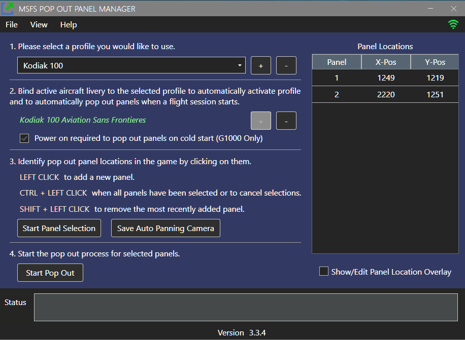
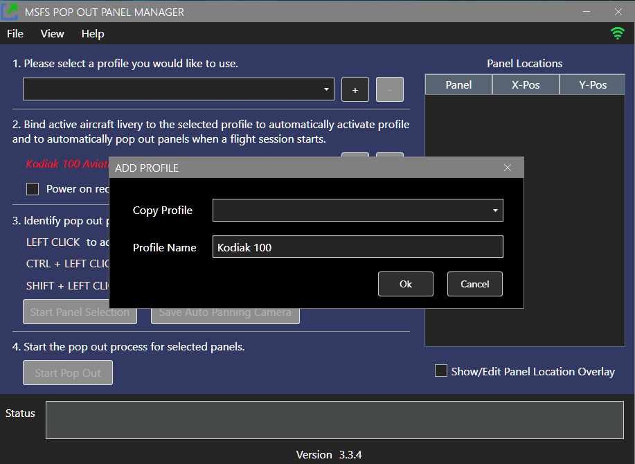
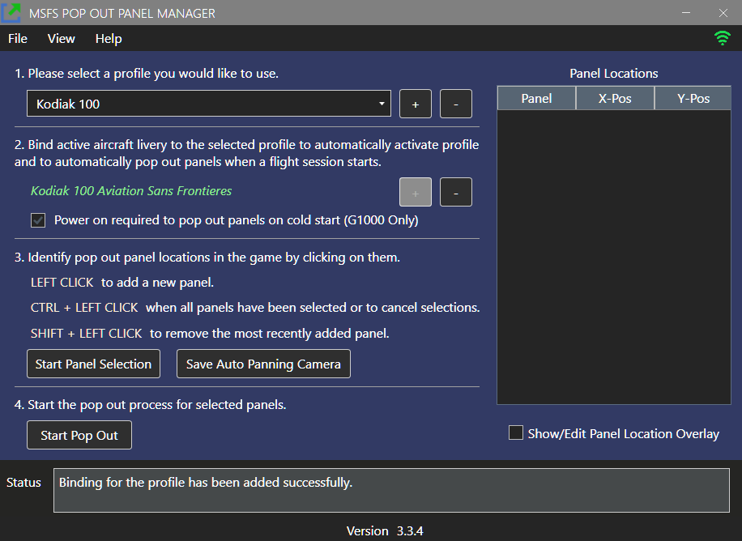
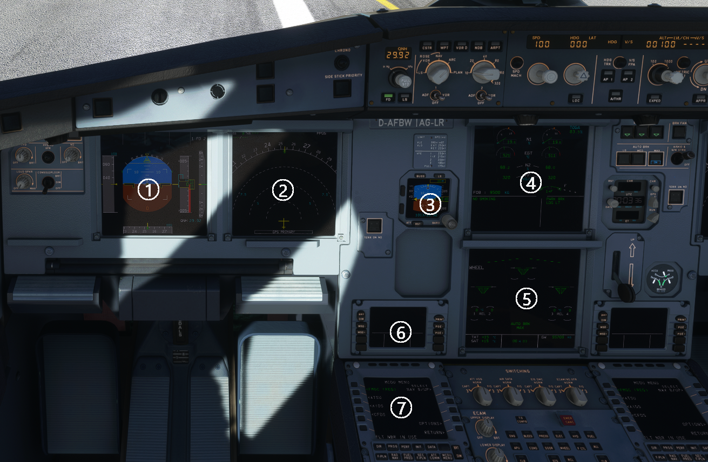

# MSFS Pop Out Panel Manager

MSFS Pop Out Panel Manager is an application for MSFS 2020 which helps pop out, save and position pop out panels to be used by utilities such as Sim Innovations Air Manager or to place pop out panels onto your screen or another monitor at predetermined locations automatically.

Please follow [FlightSimulator.com](https://forums.flightsimulator.com/t/msfs-pop-out-panel-manager-automatically-pop-out-and-save-panel-position/460613) forum thread regarding this project or comments at [Flightsim.to](https://flightsim.to/file/35759/msfs-pop-out-panel-manager). 

[Online video - How to use](https://vimeo.com/723158934) 

[Online video - How to enable auto pop out panels](https://vimeo.com/723165248)

## Touch Panel Feature
I'm happy to announce touch enabled feature works pretty well out of the box with the release of MSFS SU10 on either direct connected touch monitor or on pop out window that is displayed on tablet using software tool such as SpaceDesk. Until Asobo actually allow touch passthrough for panels, this tool can serve as a stopgap solution.

I've tested touch operation on GTN750, GTN530, KingAir PFD/MFD, TMB 930 FMS, Flybywire A32NX EFB and they are operational. Please report any issues that you encounter when using touch enable feature. There is still room for improvement and I'll continue my effort to make touch work better and better.

Things that work out of the box:

* General button click using touch
* Touch and drag such as when panning maps or using scrollbars
* Works on touch monitor or tablet with SpaceDesk
* Flight control will be regained after 0.5 second (adjustable) of touch inactivity on a panel. This will minimize current MSFS bug where lost of flight control when operating pop out panels.

If using SpaceDesk to host pop out panel display, since there is a latency for touch response in wireless display, your touch may not register consistently. Please go to Preferences => Touch Settings => Touch Down Touch Up Delay, and increase the value to 25ms or higher to increase touch sensitivity.

## Application Features
* Display resolution independent. Supports 1080p/1440p/4k display and ultrawide displays.

* Support multiple user defined aircraft profiles to save panel locations to be recalled later.

* Intuitive user interface to defined location of panels to be popped out.

* [Auto Pop Out](#auto-pop-out-feature) feature. The application will detect active aircraft and activate the corresponding profile on start of new flight session.

* [Cold Start feature](#auto-pop-out-feature). Instrumentation panels can be popped out even when they're not powered on (for G1000 /  / G1000 NXi planes only).

* Auto Panning feature remembers the cockpit camera angle when you first define the pop out panels. You can now pan, zoom in, and zoom out to identify offscreen panels and the camera angle will be saved and reused. This feature requires the use of Ctrl-Alt-0 keyboard binding to save custom camera view per plane configuration. (Can be configured to use 0 through 9). If the keyboard binding is currently being used. The auto-panning feature will overwrite the saved camera view if enabled.

* Fine-grain control in positioning of panels down to pixel level. 

* Panels can be configured to appear always on top, with title bar hidden, or stretch to full screen mode.

* Auto disable Track IR when pop out starts.

* User-friendly features such as application always on top, auto start, minimized to tray with keyboard shortcuts.

* Auto save feature. All profile and panel changes are saved automatically.

* Auto update feature. Application can auto-update itself when new version becomes available.

* Enable touch support for pop outs on touch capable  display. Please see [Touch Enable Pop Out Feature](#touch-enable-pop-out-feature) for more information.

## History: Pop Out Panel Positioning in MSFS
In MSFS, by holding **RIGHT ALT** + **LEFT CLICKING** some instrumentation panels, these panels will pop out as floating windows that can be moved to a different screen location or different monitor. But this needs to be done every time you start a new flight. You've to perform RIGHT-ALT click, split out child windows, move these windows to final location, rinse and repeat. For predefined toolbar menu windows such as ATC, Checklist, VFR Map, their positions can be saved easily and reposition at the start of each new flight using 3rd party windows positioning tool because these windows have a **TITLE** in the title bar when they are popped out. But any custom pop outs such as plane instrumentation panel do not have window title. This makes remembering their last used position more difficult and it is very annoying to resize and re-adjust their positions to be used by Air Manager or other overlay tool on each new flight.

What if you can do the setup once by defining on screen where the pop out panels will be, click a button, and the application will pop these panels out and separate them for you. You just need to move these panels to their final positions only once. Next time when you start a flight, with a single button click, your panels will automatically pop out for you and move to their preconfigured positions. Easy peasy lemon squeezy!

## How to Install 

1. After downloading the latest zip package from github repository or from Flightsim.to website, extract the zip package to a folder of your choice on your computer.

2. If you're using Auto Pop Out Panel feature, a plugin is required to be installed in MSFS community folder. Please copy the folder "zzz-ready-to-fly-button-skipper" into your MSFS community folder. This plugin is used to automatically skip the "Ready to Fly" button press when a flight starts so Auto Pop Out Panel can start its process.

3. Start the application **MSFSPopoutPanelManager.exe** and it will automatically connect when MSFS/SimConnect starts. 

## How to Update

1. To update the application, you can download the latest zip package and directly extract the package into your Pop Out Manager installation folder and overwrite all files within. Your application setting and profile data will be safe.

2. You can also use the built-in auto update feature and let the application handles the update. If the update is optional, you can skip the update if you so choose. When you start the application and if an update is available, a dialog will appear and it will show the latest version's release notes and an option to update the application.

3. If you're not being prompt for update when a new update is available, please try the following fixes:

  - Restart you computer and most of the time this will do the trick.
  - Clear your default web browser cache on your computer since auto update will try to download latest version of update configuration file from github repository and the file may have been cached on your machine.
  - Clear Internet Browser History.  First search for "Internet Options" in Windows control panel. In "General" tab, select "Delete" in Browsing History section.

## How to Use

[Online video - How to use](https://vimeo.com/723158934) 

1. First start the application and the game. Once you're in the main menu of the game, you can create a new profile by clicking the "plus" button in step 1 of the app.
 

2. If you want to associate the profile to the current aircraft to use in [Auto Pop Out](#auto-pop-out-feature) feature or for automatic profile switching when selecting a different aircraft, click the "plus" button next to the aircraft name. The aircraft title will become green once  it is bound to the profile. Your chosen aircraft may not be available to select in the application for your newly selected plane until a flight is started. If the current aircraft has not been bound to another profile, it will be bound to your newly created profile automatically.

 

 
3. Now start a flight with your chosen aircraft. Once your flight is started, you're ready to select the panels you want to pop out. Please click "Start Panel Selection" to define where the pop out panels will be using **LEFT CLICK**. Use **CTRL-LEFT CLICK** when selection is completed. You can also move the number circles at this point to do final adjustment.
 

4. Next, click "Start Pop Out". At this point, please be patient. The application will start popping out and separating panels one by one and you will see a lot of movements on screen. If something goes wrong, just follow the instruction in the status message and try again. Once the process is done, you will see a list of panels line up in the upper left corner of the screen. All the panels are given a default name. You can name them anything you want as needed.

5. You can now start panel configuration by dragging the pop out panels into their final position (to your main monitor or another monitor). You can also type value directly into the data grid to move and resize a panel. The +/- pixel buttons by the lower left corner of the grid allow you to change panel position at the chosen increment/decrement by selecting the data grid cell first (X-Pos, Y-Pos, Width, Height). You can also check "Always on Top", "Hide Title Bar", or "Full Screen Mode" if desire. If the panel is touch capable, you can check "Touch Enabled". Please see [Touch Enable Pop Out Feature](#touch-enable-pop-out-feature) regarding this experimental feature. Once all the panels are at their final position, just click "Lock Panel" to prevent further panel changes.
 

6. To test if everything is working, please click "Restart" in the File menu. This will close all pop outs. Now click "Start Pop Out" and see the magic happens!

7. With auto panning feature enabled in preferences setting, you do not have to line up the circles that identified the panels in order for the panels to be popped out. But if you would like to do it manually without auto-panning, on next start of the flight, just line up the panels before clicking "Start Pop Out" if needed.

## Auto Pop Out Feature

[Online Video - How to enable auto pop out panels](https://vimeo.com/723165248)

The app will try to find a matching profile with the current selected aircraft. It will then detect when a flight is starting and automatically click the "Ready to Fly" button. It will also power on instrumentation for cold start (for G1000/NXi equipped plane only), and then pop out all panels. This feature allows panels to be popped out without the need of user interaction. If profiles are set and bound to your frequently used aircraft, you can auto-start the app minimized in system tray and as you start your flight, panels will automatically pop out for you for the selected aircraft.

* In File->Preferences->Auto Pop Out Panel Settings, "Enable Auto Pop Out Panels" option is turned on. You can also adjust wait delay settings if you've a fast computer.

* For existing profile to use Auto Pop Out feature, just click the plus sign in the bind active aircraft to profile section. This will bind the active aircraft being displayed to the profile. Any bound aircraft will appear in GREEN color. Unbound ones will be in WHITE, and bound aircraft in another profile will be in RED. You can bind as many aircrafts to a profile as you desire but an aircraft can only bind to a single profile so Auto Pop Out knows which profile to start when a flight session starts.

* During my testing, instrumentations only need to be powered on for Auto Pop Out to work for G1000/G1000 NXi plane during cold start. There seems to be a bug in the game that you can't do Alt-Right click to pop out cold start panel for this particular plane variant. For other plane instrumentations I've tested (G3000, CJ4, Aerosoft CRJ 550/700, FBW A32NX), panels can be popped out without powering on. So please make sure the checkbox "Power on required to pop out panels on cold start" is checked for G1000 related profiles.

* **TIPS:** One trick to force SimConnect to update the current selected aircraft so you can do the binding immediately after selecting a new aircraft in the World Map is to click the "Go Back" button at the lower left of your screen.  You should see aircraft title changes to the active ones. Or you can wait until the flight is almost fully loaded and you will see the current aircraft name gets updated.

## Touch Enable Pop Out Feature

[Online video - Touch enable panel in action](https://vimeo.com/manage/videos/719651650)

This feature will make pop out panel touch enabled on touch screen monitor or tablet (through remote display tool such as [Spacedesk](https://www.spacedesk.net/). Currently there is limitation in MSFS regarding the support of touch capability for pop out panels on touch enabled display. Pop out instrumentation panels that have touch capabilities and are not limited to:

- King Air 350
- PMS GTN750
- PMS GTN530
- Lower touch panel in TBM 930
- Flybywire A32NX EFB

This touch enabled pop out feature solved 2 limitations but currently in MSFS.

- Limitation #1 - For pop out panel, touch events do not get pass through to panels such as King Air PFD or GTN750 and they can only be operated with a mouse. There is a work around if you’re using Spacedesk with tablet by disabling USB HID within Spacedesk drivers in Windows device manager. But if you’re using touch monitors directly connected to your gaming PC, then Spacedesk workaround is not an option.

- Limitation #2 - When you click or hover your mouse over any pop out panels on your main monitor or on another monitor, the game main window will lose focus and you can’t operate flight control without clicking the game window again.

#### How to enable touch support

Perform your regular panel selection and once your touch capable panel has been popped out, in the configuration screen grid, just check "Touch Enabled" to enable touch support for the selected panel.

## User Profile Data Files

The user plane profile data and application settings data are stored as JSON files under your "Documents" folder. (%userprofile%\Documents\MSFS Pop Out Manager)

* userprofiledata.json

  Stored your various plane profiles.

* appsettingdata.json

  Stored your application preference settings.
  
* autoupdate.json

  Stored the application auto update information. This file can be deleted if you want to reset your update status.
  
You can backup this folder and restore this folder if you want to uninstall and reinstall MSFS Pop Out Manager.

## Current Known Issue

* Automatic power on for Auto Pop Out Panels feature will not work if you're using any flight control hardware (such as Honeycomb Alpha or Bravo) that permanently binds the master battery switch or master avionics switch. If the hardware control switch is in the off position, pop out manager won't be able to temporary turn on the instrumentation panels to pop them out. This seems to be a bug on Asobo side and only affects the G1000 instrumentation at the moment.

* Please see [Version](VERSION.md) file for latest known application issues.

 

 
## Common Problem Resolution

* If Pop Out Panel Manager is not running correctly such as panels fail to pop out even all keyboard control bindings are set correctly, please try running the application as administrator and it may resolve the issue..

* Unable to pop out panels when creating a profile for the first time with error such as "Unable to pop out panel #X". If the panel is not being obstructed by another window, by changing the sequence of the pop out when defining the profile may help solve the issue. Currently there are some panels in certain plane configuration that does not follow predefined MSFS pop out rule.

* Unable to pop out panels on subsequent flight. Please follow status message instruction. Also, if using auto-panning, Ctrl-Alt-0 may not have been saved correctly during profile creation. You can trigger a force camera angle save by clicking the "Save Auto Panning Camera" button for the profile. 

* Unable to pop out ALL panels. This may indicate a potential miscount of panels (circles) and the number of actual panels that got popped out. You may have duplicate panels in your selection or panels that cannot be popped out.

* If you encounter application crashes or unknown error, please help my continuing development effort by attaching the file **error.log** in the application Logs folder and open an issue ticket in github repo for this project. This is going to help me troubleshoot the issue and provide hotfixes.

* If you encounter an issue with panels that are not restored back to your saved profile locations, please check if you have other apps such as Sizer or Windows PowerToys that may have conflict with Pop Out Manager.
 
* If you encounter a critical error with error message like this:

  ERROR MSFSPopoutPanelManager.WpfApp.App - Could not load file or assembly 'Microsoft.FlightSimulator.SimConnect, Version=11.0.62651.3, Culture=neutral, PublicKeyToken=baf445ffb3a06b5c'. An attempt was made to load a program with an incorrect format. System.BadImageFormatException: 

  This usually happens on clean Windows installation. Pop Out Panel Manager uses x64 version of SimConnect.dll to perform its function and a Visual C++ redistributable is required for SimConnect to run correctly. Please download and install the following [VC++ redistributable](https://aka.ms/vs/17/release/vc_redist.x64.exe) on your PC to resolve this issue. Further information can be obtained in this [support ticket](https://github.com/hawkeye-stan/msfs-popout-panel-manager/issues/21). 

## Author
Stanley Kwok
[hawkeyesk@outlook.com](mailto:hawkeyesk@outlook.com) 

I welcome feedback to help improve the usefulness of this application. You are welcome to take a copy of this code to further enhance it and use within your own project. But please abide by licensing terms and keep it open source:)

## Donation

Thank you for your super kind support of this app!

## Credits
[WindowsHook](https://github.com/topstarai/WindowsHook) by Mark Kang

[Fody](https://github.com/Fody/Fody) .NET assemblies weaver by Fody

[MahApps.Metro Dark Theme](https://github.com/MahApps/MahApps.Metro)  by Jan Karger, Dennis Daume, Brendan Forster, Paul Jenkins, Jake Ginnivan, Alex Mitchell

[Hardcodet NotifyIcon](https://github.com/hardcodet/wpf-notifyicon) by Philipp Sumi, Robin Krom, Jan Karger

[WPF CalcBinding](https://github.com/Alex141/CalcBinding) by Alexander Zinchenko

[AutoUpdater.NET](https://github.com/ravibpatel/AutoUpdater.NET) by Ravi Patel

