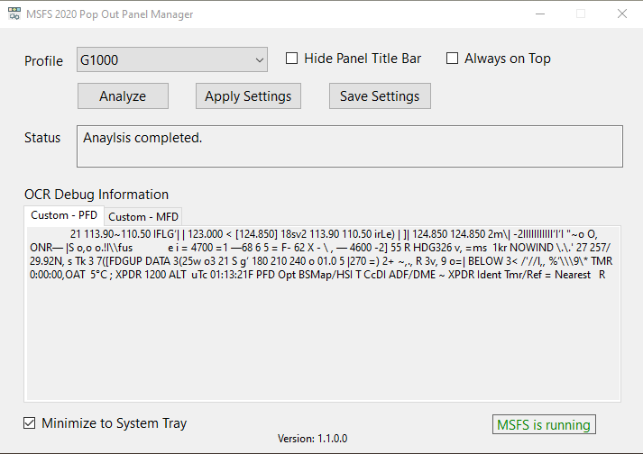

# MSFS Pop Out Panel Manager
MSFS Pop Out Panel Manager is a utility application for MSFS 2020 which helps save and position pop out panels such as PDF and MFD to be used by applications such as Sim Innovations Air Manager's overlay. This is a **proof of concept** application since I do not use Air Manager so I'm kind of guessing how it works. I kept reading messages on flightsimulator.com that flightsimers would like a utility like this so as a coding exercise I just created it. I welcome any feedback to help improve the accuracy and usefulness of this utility. You are welcome to take a copy of this code to further enhance it and use within anything you created.

## Pop Out Panel Positioning Annoyance
In MSFS, by holding **Right-Alt** + **Left Clicking** some instrumentation panels, these panels will pop out as floating windows that can be moved to a different monitor. But this needs to be done every time you start a new flight. Predefined toolbar menu windows such as ATC, Checklist, VFR Map can also be popped out. For these MSFS predefined toolbar menu windows, their positions can be saved easily and reposition at the start of each new flight using 3rd party windows positioning tool because these windows have a **title** for the pop out. But panels such as PFD and MFD on G1000 or the FMS panel on G3000 or panels on A320/CJ4 do not have window title. This makes remembering their last used position more difficult and it seems very annoying to resize and readjust their positions to be used by Air Manager or other overlay tool on each new  flight.

## Concept to Fix this Annoyance
The concept to determine the untitled panels to be reposition is pretty straight forward:
 - User will pop out the individual untitled panel.
 - This utility will take a screenshot of each panel.
 - The screenshot images will be fed into OCR using  [Tesseract](https://github.com/charlesw/tesseract/) package.
 - The OCRed text (mostly 'gibberish' by the way) will be compared to a predefined set of keywords that are defined by the user. These comparison text can be customized and additional panel types and profiles can be [added](#profile-and-ocr-data-file-definition) for various plane configurations.
 - By being able to identify the untitled panels, this solves the problem of not able to easily reposition these panel in subsequent flight.
 
## Application Workflow Steps
 1. User starts the utility. The application will automatic connect when MSFS starts.
 2. User pops out the **Individual** untitled panels such as MFD or PFD on G1000 in MSFS. **Please make sure  the pop out panels are not inactive/blank.** If so, there will be nothing to analyze.
 3. **Important!** User choose the desired profile.
 4. User selects **Analyze** for the panels that were popped out.
 5. Once analysis is completed, user positions these untitled panels in addition to any predefined toolbar menu panels to the desired location on the screen.
 6. User **Saves** the positions of these panels.
 7. In subsequent flight, user pops out the untitled and/or predefined panels again.
 8. User selects **Analyze**.
 9. These panels will then automatically reposition themselves to their saved positions.
  
## User Interface
<p align="center">

</p>

### OCR Debug Information
All untitled panels OCR extracted text will be represented here by an individual tab. When an untitled panel failed analysis, a tab control marked ***Failed Analysis - xxxx*** will be shown. You can use the extracted text here (if any) as basis to adjust the OCR data definition file. 

## OCR Concept / Further Enhancement

 - Currently, Tesseract OCR recognition is not very accurate but is good enough!
 - Screenshot images text recognition can be [customized](#profile-and-ocr-data-file-definition) by configuration file for better accuracy.
 - To enhance the initial accuracy of Tessearat OCR, the screenshot has its color inverted, then sharpened, then grayscale before text recognition occurs.
 - I only used the default Tessearact OCR function. There are probably better way to improve the accuracy with OCR advanced features and more image preprocessing.
 - For panels that have no obvious text such as some of the pop out gauges on A320, currently these panels cannot be recognized. Maybe for future enhancement, using color mapping or snippet of screenshot to do the comparison.

## Profile and OCR Data File Definition
The file definition [config/ocrdata.json](config/ocrdata.json) is pretty self-explanatory. This file is used to define the plane profile for selection in the UI and to define the keywords to be compared on each panel. You can add additional profiles to the file. Below is a sample profile for G1000 that has pop out PFD and a MFD panel:
```
[
  // G1000
  {
    "profile": "G1000",
    "defaultProfile": "true",
    "ocrImageScale": 1.0,
    "evalData": [
      {
        "popoutName": "PFD",
        "data": [ "PFD", "XPDR", "Nearest", "MAP/HSI", "Ident", "Tmr/Ref" ]
      },
      {
        "popoutName": "MFD",
        "data": [ "FUEL", "QTY", "GAL", "FFLOW GPH", "OIL", "PRESS", "ELECTRICAL", "BATT", "VOLTS", "Navigation Map" ]
      }
    ]
  }
]
```
 - ***profile*** - name of profile for selection in the UI.
 - ***defaultProfile*** - set as default profile to be selected on the Profile dropdown in the UI.
 - ***ocrImageScale*** - adjust the screenshot image scale to enhance OCR accuracy (can be bigger or smaller and can be different for each profile).
 - ***evalData*** - a list of panels for this profile and the associated keyword comparison data
		 - ***popoutName*** - name for the untitled panel, you can name it anything you want but must be unique for the profile.
		 - ***data*** - the keyword list, add to or remove from this list to improve matching accuracy. The string comparison is **case insensitive**.

** **evalData** comparison is executed in listed order. So if the same keyword appears in multiple pop out definitions, the first match wins. So please try to choose keywords that are unique to the panel. You can use [OCR debugger information](#user-interface) in the UI to finetune the text that are being extracted from the screenshot image.

## Common Problem Resolution

 - Failed Analysis - Make sure to select correct/desire profile before clicking Analyze.
 - Failed Analysis - Experiment with ocrImageScale and keyword list in ocrdata definition file.

## Author
Stanley Kwok
[hawkeyesk@outlook.com](mailto:hawkeyesk@outlook.com) 

## Credits
 [Charles Weld Tesseract](https://github.com/charlesw/tesseract/) .NET wrapper for Tesseract OCR package.

 [SixLabors.ImageSharp](https://github.com/SixLabors/ImageSharp) 2D graphics API package.